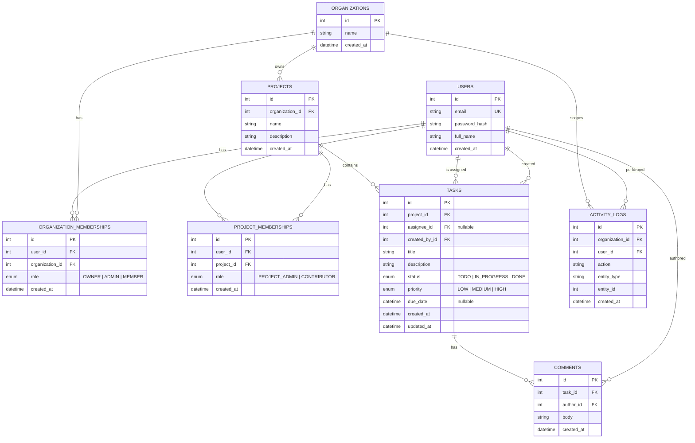

# Database ER Diagram
## Multi-Tenant Project Management API

The schema below is rendered automatically by GitHub. `PK` = primary key,
`FK` = foreign key, `UK` = unique key.

```mermaid
erDiagram
    USERS ||--o{ ORGANIZATION_MEMBERSHIPS : "has"
    ORGANIZATIONS ||--o{ ORGANIZATION_MEMBERSHIPS : "has"
    USERS ||--o{ PROJECT_MEMBERSHIPS : "has"
    PROJECTS ||--o{ PROJECT_MEMBERSHIPS : "has"
    ORGANIZATIONS ||--o{ PROJECTS : "owns"
    PROJECTS ||--o{ TASKS : "contains"
    USERS ||--o{ TASKS : "is assigned"
    USERS ||--o{ TASKS : "created"
    TASKS ||--o{ COMMENTS : "has"
    USERS ||--o{ COMMENTS : "authored"
    ORGANIZATIONS ||--o{ ACTIVITY_LOGS : "scopes"
    USERS ||--o{ ACTIVITY_LOGS : "performed"

    USERS {
        int id PK
        string email UK
        string password_hash
        string full_name
        datetime created_at
    }
    ORGANIZATIONS {
        int id PK
        string name
        datetime created_at
    }
    ORGANIZATION_MEMBERSHIPS {
        int id PK
        int user_id FK
        int organization_id FK
        enum role "OWNER | ADMIN | MEMBER"
        datetime created_at
    }
    PROJECTS {
        int id PK
        int organization_id FK
        string name
        string description
        datetime created_at
    }
    PROJECT_MEMBERSHIPS {
        int id PK
        int user_id FK
        int project_id FK
        enum role "PROJECT_ADMIN | CONTRIBUTOR"
        datetime created_at
    }
    TASKS {
        int id PK
        int project_id FK
        int assignee_id FK "nullable"
        int created_by_id FK
        string title
        string description
        enum status "TODO | IN_PROGRESS | DONE"
        enum priority "LOW | MEDIUM | HIGH"
        datetime due_date "nullable"
        datetime created_at
        datetime updated_at
    }
    COMMENTS {
        int id PK
        int task_id FK
        int author_id FK
        string body
        datetime created_at
    }
    ACTIVITY_LOGS {
        int id PK
        int organization_id FK
        int user_id FK
        string action
        string entity_type
        int entity_id
        datetime created_at
    }
```